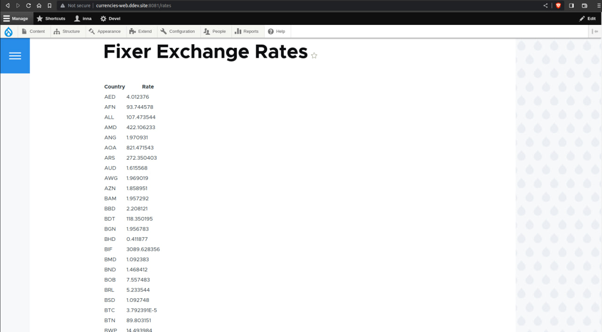
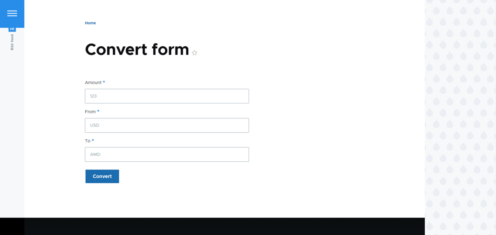
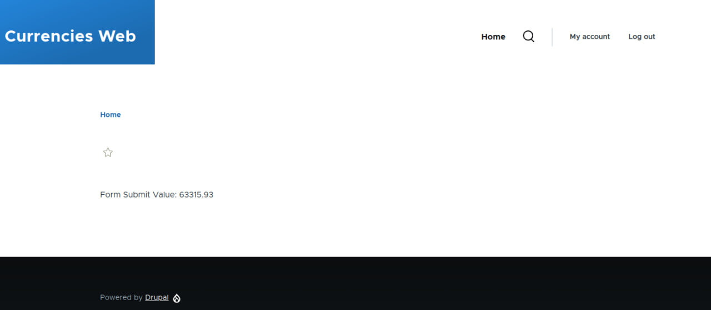

# Currency Converter

Тестовое задание (на русском).

Необходимо создать модуль для Drupal 9 для хранения и конвертации валют.
Модуль должен иметь предопределенный список валют (на усмотрение разработчика - захардкожен в модуле или добавляется через админку). Курсы валют должны быть загружены с http://fixer.io/ (документация по API по ссылке https://fixer.io/documentation) для всех доступных валют и сохранены в БД. Обновления курсов должно происходить раз в сутки. Модуль должен предоставить сервис для конвертации цены из одной валюты в другую (использование примерно такое $converter->convert(123, ‘USD’, ‘RUB’);). Также должна быть создана страница в админке, где должны быть выведены все сохраненные курсы валют.

Test (in English).

Create a module for Drupal 9 for storing and converting currencies.
The module must have a predefined list of currencies (at the discretion of the developer - hardcoded in the module or added via the admin panel). Exchange rates should be downloaded from  (API documentation at https://fixer.io/documentation) for all available currencies and stored in the database. Rates should be updated once a day. The module should provide a service for converting prices from one currency to another (using something like this $converter->convert(123, 'USD', 'RUB');). Also, a page in the admin panel should be created, where all saved exchange rates should be displayed.

# How to test

Pull and Install the project,

Go to <b>Admin->Configuration->System->Fixer API Integration</b>

Add your API key and Save Config

To see exchange rates go to
  <b>/rates</b>

To convert values go to
  <b>/convert</b>

# Screenshots

